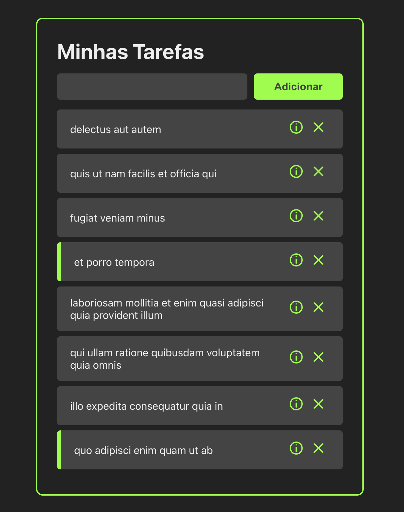

# Task List

Studies of react created components and some hooks.



#### Next steps

- Learn about states 
- Learn about shared functions between components

In relation to the original, the main changes were in the routing and the passing of parameters between components, the way of passing parameters and functions and the declaration of types became verbose.. check if there is a way to simplify

Original project 
```https://www.youtube.com/watch?v=ErjWNvP6mko```


